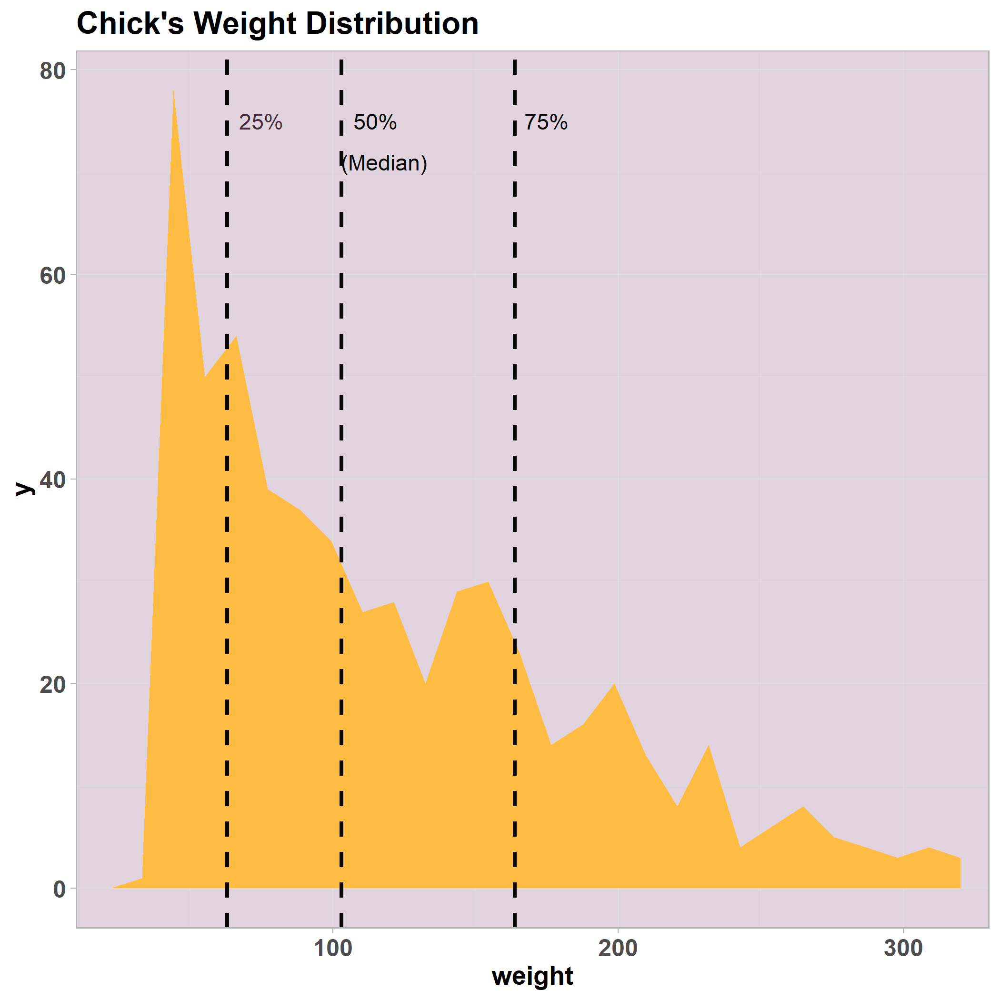

```{r setup, include=FALSE}
knitr::opts_chunk$set(echo = TRUE)
```

<div class="Intro">

<p class="line"> --------------------------------------------------------------------------------------------------</p>

## Packages needed to run this markdown

Whereas no special packages are needed for basic univariate analysis in R. Throughout this document, there are some snippets of code that use ggplot2 and pander. Ggplot2 is one of the key packages in R to build graphs, while pander helps to render pretty tables in markdowns without much user input. 


```{r Importing Packages, message=FALSE, warning=FALSE}
library(ggplot2)
library(pander)

```

<p class="line"> --------------------------------------------------------------------------------------------------</p>

</div>

## Introduction to Univariate Analysis

**Univariate Analysis**: Description of a single variable. It is useful to summarise and find patterns in the data, and often useful to get a grasp of your data before proceding with further analyses. 

### Numeral descriptive techniques (for interval variables)

*	**Measures of central tendency**: mean, median, mode

*	**Measures of variability**: range (Maximum-Minumum values), variance, standard deviation


*Note: Frequency tables are often used for categorical variables*

### Graphical descriptive techniques:

* **Pie chart**: show relationships between different categories of a nominal or ordinal variable

* **Bar chart**: describe the frequencies of different categories of a nominal or ordinal variable

* **Histograms**: describe the frequency (or proportion) distribution of an interval variable


## Dataset Description

The following code uses the Chicks dataset, which is a data frame available in R that represents Chicks in four different diet. The dataset has four columns:

<table class="doctable">
 <tr>
    <th> Variable </th>
    <th> Description </th>
  </tr>
  <tr>
    <td>Weight </td>
    <td> The weight of the chick </td>
  </tr>
  <tr>
    <td>Time </td>
    <td> The time at which the measurements were taken </td>
  </tr>
  <tr>
    <td>Chick </td>
    <td> The chick identifier (in kg) </td>
  </tr>
  <tr>
    <td>Diet </td>
    <td> The diet that the chick was following (in kg) </td>
  </tr>
</table>

</br>

### Dataset Overview

There are **two key functions** to get an initial overview of a dataset: **summary() and str()**:

```{r}
Chicks <- ChickWeight   #Reads the data Chickweight and assigns is to the variable "Chicks"

pander(summary(Chicks))  #summary(chicks) gives the overview of the data, with most of the numerical univariate analysis
```

```{r}
str(Chicks)
```
**str()** gives an overview of the dataset. We can see that the dataset has 578 observations (rows) of 4 variables (columns). The column weight is numeric, Time as well, Chick is an ordered factor and Diet is a factor. 

*[note: factor = category]*

## Numerical Descriptive Techniques

### Measures of Central Tendency

<br>

**Mean**:

```{r}
#mean 
mean(Chicks$weight)
```

* [Note: the symbol "\$" is used to select columns of a Dataset by name. E.g. weight is a column of the Chicks dataset, and Chicks\$weight() gives us the mean of the weight of the Chicks. ]*

<br>

**Median:**

```{r}

#median 
median(Chicks$weight)
```

<br>

**Mode**:

Whereas R basic packages provide functions for the median and median, you will have to find one with a mode() function. Alternatively, you can program the mode yourself by setting a counter that provides you with the most recurrent value.  

You could use the following function: which.max(tabulate(data$variable)). Basically this is asking R to tabulate the variable (do a frequency table of how often all the values appear) and then to show you which one is the maximum one. This is useful for unimodal datasets, where only one mode is present. 


```{r}
#mode - No standard function and multiple ways
which.max(tabulate(Chicks$weight))
```

### Measures of Variability


**Quantiles**

Quantiles are a good way to understand the distribution of your data. A high interquartile range (Q3-Q1) indicates that the distribution is very dispersed, whereas a low one indicates that the values are very similar and concentrated.

Below is a graph of the variable Weight distribution and the first, second and third quartiles. 


 </img>

The most used Quantiles are:

* 25% --> Quartile 1 (Q1) (25% of the data is below this value)

* 50% --> Quartile 2 (Q2) (50% of the data points are below this value, this is the same as the median)

* 75% --> Quartile 3 (Q3) (75% of the data points are below this value)

```{r}
#Quartiles
quantile(Chicks$weight)

#Inter Quartile Range
IQR(Chicks$weight)
```

<br>

**Standard Deviation**

The Standard deviation is good to measure how widespread a dataset is relative to the mean. It considers the difference between each of the observations and the mean. The standard deviation is the square root of the variance. R has an integrated function for it. 

```{r}
sd(Chicks$weight)
```
<br>

**Variance**

Variance is another measure of dispersion, which is the square of the variance. It is calculated by summing the squared differences between each data point and the mean, and then dividing it by the number of observations. It is a good measure of dispersion, however, as opposed to the standard deviation, it is not represented in the same units as the data, since it is squared. 

Again, R has an easy function to compute the variance. 

```{r}
var(Chicks$weight)
```

<br> 

## Inspecting Factors: Frequency Distributions

To inspect Factors (non-numeric variables, such as categories) we can find the frequency distribution. That is, how many times each value appears on the data. A simple way to do it is to use the function summary() over the variable or table().

For example, we can investigate how many chickens are following each diet. 

```{r}
table(Chicks$Diet)
summary(Chicks$Diet)
```


## Dealing with NAs in the Data
<br>
It is important to note that if you have missing values in the data, most of the function's above will not work. While there are a couple of ways to deal with missing data, the easiest way to compute these metrics is to "skip" the NA values and only do the computation with the actual values that we have.

Most of these functions have an argument "na.rm" that automatically excludes missing values when set to True. 
```{r}
#Generate missing values
Chicks[1,1] <- NA

#Gives error 
mean(Chicks$weight) 

#use na.rm = True will exclude NAs from the calculation
mean(Chicks$weight, na.rm = TRUE) 
```


## Appendix

### Tabulate function output

```{r}
tabulate(Chicks$weight)
```

### Plot Code

```{r warning=FALSE, message=FALSE}

colors <- c("#ac3931","#537d8d","#ffbc42","#482c3d","#b2edc5","#0a0908","#e0d3de")

ggplot(Chicks, aes(weight)) +
  geom_area(stat= "bin", fill = colors[3]) +
  theme_light() + 
  geom_vline(xintercept = 63, color = colors[6], linetype = "dashed", size = 1) +
  geom_vline(xintercept = 103, color = colors[6], linetype = "dashed", size = 1) +
  geom_vline(xintercept = 163.75, color = colors[6], linetype = "dashed", size = 1) +
  theme(axis.text.x = element_text(face="bold", size=12),
        axis.text.y = element_text(face="bold", size = 12),
        axis.title = element_text(face = "bold", size = 13), 
        panel.background = element_rect(fill = colors[7],
                                        colour = "lightblue",
                                        size = 0.5, linetype = "solid"),
        title = element_text(face = "bold", size = 13)) +
  scale_x_continuous(expand = c(0,0),
                     limits = c(10,330)) +
  ggtitle("Chick's Weight Distribution") +
  annotate(geom="text", x=75, y=75, label="25%",
           color= colors[4]) +   
  annotate(geom="text", x=115, y=75, label="50%",
                                          color= colors[6]) +
  annotate(geom="text", x=118, y=71, label="(Median)",
           color= colors[6]) + 
  annotate(geom="text", x=175, y=75, label="75%",
           color= colors[6])
```

